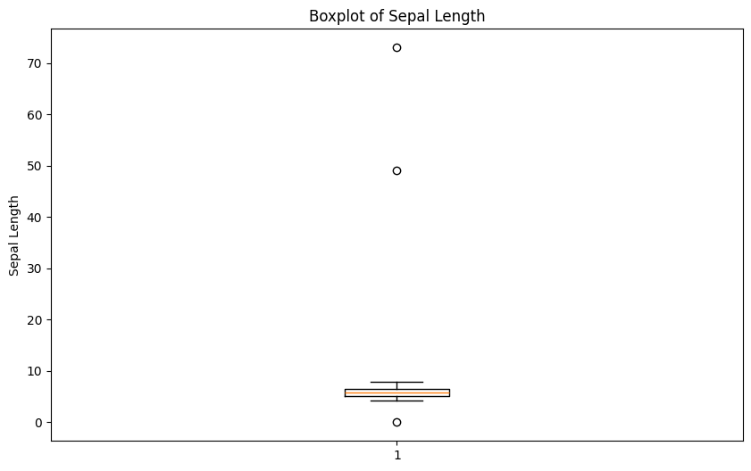
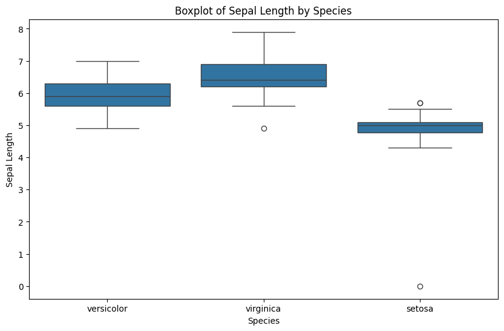
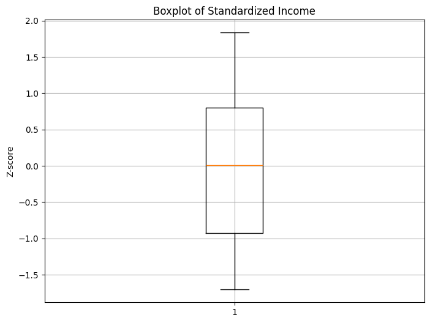
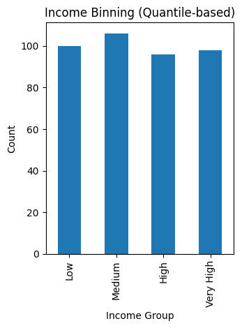
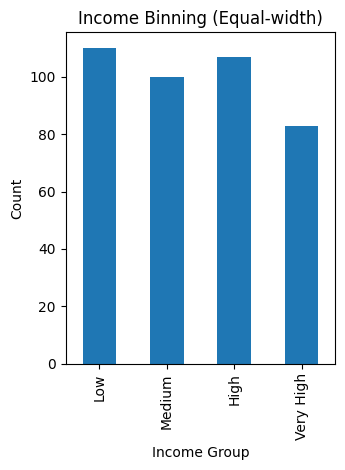
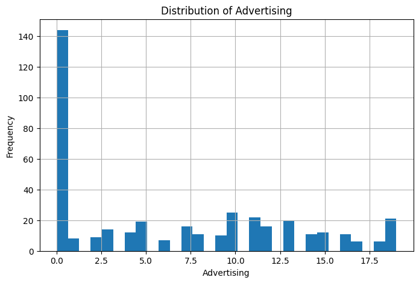

# Import Required Libraries
Import the necessary libraries, including pandas, numpy, and any other required libraries.


```python
# Import Required Libraries
import pandas as pd
import numpy as np
from sklearn.ensemble import RandomForestClassifier
import warnings
import ssl
# Suppress warnings
warnings.filterwarnings('ignore')
# Disable SSL verification
ssl._create_default_https_context = ssl._create_unverified_context
import requests
from io import StringIO
```

# Load Data
Load the dataset from the provided URL using pandas.


```python
# Load Data
url = "https://raw.github.com/edwindj/datacleaning/master/data/dirty_iris.csv"
response = requests.get(url, verify=False)
data = StringIO(response.text)
dirty_iris = pd.read_csv(data, sep=",")
print(dirty_iris.head())
```

       Sepal.Length  Sepal.Width  Petal.Length  Petal.Width     Species
    0           6.4          3.2           4.5          1.5  versicolor
    1           6.3          3.3           6.0          2.5   virginica
    2           6.2          NaN           5.4          2.3   virginica
    3           5.0          3.4           1.6          0.4      setosa
    4           5.7          2.6           3.5          1.0  versicolor


# Introduce Missing Values
Randomly introduce missing values into the dataset to mimic the R code behavior.


```python
# Load additional data
carseats = pd.read_csv("https://gist.githubusercontent.com/armgilles/194bcff35001e7eb53a2a8b441e8b2c6/raw/92200bc0a673d5ce2110aaad4544ed6c4010f687/pokemon.csv")

# Set random seed for reproducibility
np.random.seed(123)

# Introduce missing values in 'Income' column
income_missing_indices = np.random.choice(carseats.index, size=20, replace=False)
carseats.loc[income_missing_indices, 'Income'] = np.nan

# Set another random seed for reproducibility
np.random.seed(456)

# Introduce missing values in 'Urban' column
urban_missing_indices = np.random.choice(carseats.index, size=10, replace=False)
carseats.loc[urban_missing_indices, 'Urban'] = np.nan
```

## Introduction

Analysis of data is a process of inspecting, cleaning, transforming, and modeling data with the goal of highlighting useful information, suggesting conclusions and supporting decision making.


Many times in the beginning we spend hours on handling problems with missing values, logical inconsistencies or outliers in our datasets. In this tutorial we will go through the most popular techniques in data cleansing.


We will be working with the messy dataset `iris`. Originally published at UCI Machine Learning Repository: Iris Data Set, this small dataset from 1936 is often used for testing out machine learning algorithms and visualizations. Each row of the table represents an iris flower, including its species and dimensions of its botanical parts, sepal and petal, in centimeters.

Take a look at this dataset here:


```python
dirty_iris
```


<div>
<style scoped>
    .dataframe tbody tr th:only-of-type {
        vertical-align: middle;
    }

    .dataframe tbody tr th {
        vertical-align: top;
    }

    .dataframe thead th {
        text-align: right;
    }
</style>
<table border="1" class="dataframe">
  <thead>
    <tr style="text-align: right;">
      <th></th>
      <th>Sepal.Length</th>
      <th>Sepal.Width</th>
      <th>Petal.Length</th>
      <th>Petal.Width</th>
      <th>Species</th>
    </tr>
  </thead>
  <tbody>
    <tr>
      <th>0</th>
      <td>6.4</td>
      <td>3.2</td>
      <td>4.5</td>
      <td>1.5</td>
      <td>versicolor</td>
    </tr>
    <tr>
      <th>1</th>
      <td>6.3</td>
      <td>3.3</td>
      <td>6.0</td>
      <td>2.5</td>
      <td>virginica</td>
    </tr>
    <tr>
      <th>2</th>
      <td>6.2</td>
      <td>NaN</td>
      <td>5.4</td>
      <td>2.3</td>
      <td>virginica</td>
    </tr>
    <tr>
      <th>3</th>
      <td>5.0</td>
      <td>3.4</td>
      <td>1.6</td>
      <td>0.4</td>
      <td>setosa</td>
    </tr>
    <tr>
      <th>4</th>
      <td>5.7</td>
      <td>2.6</td>
      <td>3.5</td>
      <td>1.0</td>
      <td>versicolor</td>
    </tr>
    <tr>
      <th>...</th>
      <td>...</td>
      <td>...</td>
      <td>...</td>
      <td>...</td>
      <td>...</td>
    </tr>
    <tr>
      <th>145</th>
      <td>6.7</td>
      <td>3.1</td>
      <td>5.6</td>
      <td>2.4</td>
      <td>virginica</td>
    </tr>
    <tr>
      <th>146</th>
      <td>5.6</td>
      <td>3.0</td>
      <td>4.5</td>
      <td>1.5</td>
      <td>versicolor</td>
    </tr>
    <tr>
      <th>147</th>
      <td>5.2</td>
      <td>3.5</td>
      <td>1.5</td>
      <td>0.2</td>
      <td>setosa</td>
    </tr>
    <tr>
      <th>148</th>
      <td>6.4</td>
      <td>3.1</td>
      <td>NaN</td>
      <td>1.8</td>
      <td>virginica</td>
    </tr>
    <tr>
      <th>149</th>
      <td>5.8</td>
      <td>2.6</td>
      <td>4.0</td>
      <td>NaN</td>
      <td>versicolor</td>
    </tr>
  </tbody>
</table>
<p>150 rows × 5 columns</p>
</div>


## Detecting NA

A missing value, represented by NA in R, is a placeholder for a datum of which the type is known but its value isn't. Therefore, it is impossible to perform statistical analysis on data where one or more values in the data are missing. One may choose to either omit elements from a dataset that contain missing values or to impute a value, but missingness is something to be dealt with prior to any analysis.


Can you see that many values in our dataset have status NA = Not Available? Count (or plot), how many (%) of all 150 rows is complete.


```python
# Count the number of complete cases (rows without any missing values)
complete_cases = dirty_iris.dropna().shape[0]

# Calculate the percentage of complete cases
percentage_complete = (complete_cases / dirty_iris.shape[0]) * 100

print(f"Number of complete cases: {complete_cases}")
print(f"Percentage of complete cases: {percentage_complete:.2f}%")
```

    Number of complete cases: 96
    Percentage of complete cases: 64.00%


Does the data contain other special values? If it does, replace them with NA.


```python
# Define a function to check for special values
def is_special(x):
    if np.issubdtype(x.dtype, np.number):
        return ~np.isfinite(x)
    else:
        return pd.isna(x)

# Apply the function to each column and replace special values with NaN
for col in dirty_iris.columns:
    dirty_iris[col] = dirty_iris[col].apply(lambda x: np.nan if is_special(pd.Series([x]))[0] else x)

# Display summary of the data
print(dirty_iris.describe(include='all'))
```

            Sepal.Length  Sepal.Width  Petal.Length  Petal.Width     Species
    count     140.000000   133.000000    131.000000   137.000000         150
    unique           NaN          NaN           NaN          NaN           3
    top              NaN          NaN           NaN          NaN  versicolor
    freq             NaN          NaN           NaN          NaN          50
    mean        6.559286     3.390977      4.449962     1.207299         NaN
    std         6.800940     3.315310      5.769299     0.764722         NaN
    min         0.000000    -3.000000      0.000000     0.100000         NaN
    25%         5.100000     2.800000      1.600000     0.300000         NaN
    50%         5.750000     3.000000      4.500000     1.300000         NaN
    75%         6.400000     3.300000      5.100000     1.800000         NaN
    max        73.000000    30.000000     63.000000     2.500000         NaN


## Checking consistency

Consistent data are technically correct data that are fit for statistical analysis. They are data in which missing values, special values, (obvious) errors and outliers are either removed, corrected or imputed. The data are consistent with constraints based on real-world knowledge about the subject that the data describe.


We have the following background knowledge:

-   Species should be one of the following values: setosa, versicolor or virginica.

-   All measured numerical properties of an iris should be positive.

-   The petal length of an iris is at least 2 times its petal width.

-   The sepal length of an iris cannot exceed 30 cm.

-   The sepals of an iris are longer than its petals.

Define these rules in a separate object 'RULE' and read them into R using editset (package 'editrules'). Print the resulting constraint object.


```python
# Define the rules as functions
def check_rules(df):
    rules = {
        "Sepal.Length <= 30": df["Sepal.Length"] <= 30,
        "Species in ['setosa', 'versicolor', 'virginica']": df["Species"].isin(['setosa', 'versicolor', 'virginica']),
        "Sepal.Length > 0": df["Sepal.Length"] > 0,
        "Sepal.Width > 0": df["Sepal.Width"] > 0,
        "Petal.Length > 0": df["Petal.Length"] > 0,
        "Petal.Width > 0": df["Petal.Width"] > 0,
        "Petal.Length >= 2 * Petal.Width": df["Petal.Length"] >= 2 * df["Petal.Width"],
        "Sepal.Length > Petal.Length": df["Sepal.Length"] > df["Petal.Length"]
    }
    return rules

# Apply the rules to the dataframe
rules = check_rules(dirty_iris)

# Print the rules
for rule, result in rules.items():
    print(f"{rule}: {result.all()}")
```

    Sepal.Length <= 30: False
    Species in ['setosa', 'versicolor', 'virginica']: True
    Sepal.Length > 0: False
    Sepal.Width > 0: False
    Petal.Length > 0: False
    Petal.Width > 0: False
    Petal.Length >= 2 * Petal.Width: False
    Sepal.Length > Petal.Length: False


Now we are ready to determine how often each rule is broken (violatedEdits). Also we can summarize and plot the result.


```python
# Check for rule violations
violations = {rule: ~result for rule, result in rules.items()}

# Summarize the violations
summary = {rule: result.sum() for rule, result in violations.items()}

# Print the summary of violations
print("Summary of Violations:")
for rule, count in summary.items():
    print(f"{rule}: {count} violations")
```

    Summary of Violations:
    Sepal.Length <= 30: 12 violations
    Species in ['setosa', 'versicolor', 'virginica']: 0 violations
    Sepal.Length > 0: 11 violations
    Sepal.Width > 0: 19 violations
    Petal.Length > 0: 20 violations
    Petal.Width > 0: 13 violations
    Petal.Length >= 2 * Petal.Width: 34 violations
    Sepal.Length > Petal.Length: 30 violations


What percentage of the data has no errors?


```python
import matplotlib.pyplot as plt
# Plot the violations
violation_counts = pd.Series(summary)
ax = violation_counts.plot(kind='bar', figsize=(10, 6))
plt.title('Summary of Rule Violations')
plt.xlabel('Rules')
plt.ylabel('Number of Violations')

# Add percentage labels above the bars
for p in ax.patches:
    ax.annotate(f'{p.get_height() / len(dirty_iris) * 100:.1f}%', 
                (p.get_x() + p.get_width() / 2., p.get_height()), 
                ha='center', va='center', xytext=(0, 10), 
                textcoords='offset points')

plt.show()
```


    

    


Find out which observations have too long sepals using the result of violatedEdits.


```python
# Check for rule violations
violations = {rule: ~result for rule, result in rules.items()}
# Combine violations into a DataFrame
violated_df = pd.DataFrame(violations)
violated_rows = dirty_iris[violated_df["Sepal.Length <= 30"]]
print(violated_rows)
```

         Sepal.Length  Sepal.Width  Petal.Length  Petal.Width     Species
    14            NaN          3.9          1.70          0.4      setosa
    18            NaN          4.0           NaN          0.2      setosa
    24            NaN          3.0          5.90          2.1   virginica
    27           73.0         29.0         63.00          NaN   virginica
    29            NaN          2.8          0.82          1.3  versicolor
    57            NaN          2.9          4.50          1.5  versicolor
    67            NaN          3.2          5.70          2.3   virginica
    113           NaN          3.3          5.70          2.1   virginica
    118           NaN          3.0          5.50          2.1   virginica
    119           NaN          2.8          4.70          1.2  versicolor
    124          49.0         30.0         14.00          2.0      setosa
    137           NaN          3.0          4.90          1.8   virginica


Find outliers in sepal length using boxplot approach. Retrieve the corresponding observations and look at the other values. Any ideas what might have happened? Set the outliers to NA (or a value that you find more appropiate)


```python
# Boxplot for Sepal.Length
plt.figure(figsize=(10, 6))
plt.boxplot(dirty_iris['Sepal.Length'].dropna())
plt.title('Boxplot of Sepal Length')
plt.ylabel('Sepal Length')
plt.show()
```


    

    


```python
# Find outliers in Sepal.Length
outliers = dirty_iris['Sepal.Length'][np.abs(dirty_iris['Sepal.Length'] - dirty_iris['Sepal.Length'].mean()) > (1.5 * dirty_iris['Sepal.Length'].std())]
outliers_idx = dirty_iris.index[dirty_iris['Sepal.Length'].isin(outliers)]

# Print the rows with outliers
print("Outliers:")
print(dirty_iris.loc[outliers_idx])
```

    Outliers:
         Sepal.Length  Sepal.Width  Petal.Length  Petal.Width    Species
    27           73.0         29.0          63.0          NaN  virginica
    124          49.0         30.0          14.0          2.0     setosa


They all seem to be too big... may they were measured in mm i.o cm?


```python
# Adjust the outliers (assuming they were measured in mm instead of cm)
dirty_iris.loc[outliers_idx, ['Sepal.Length', 'Sepal.Width', 'Petal.Length', 'Petal.Width']] /= 10

# Summary of the adjusted data
print("Summary of adjusted data:")
print(dirty_iris.describe())
```

    Summary of adjusted data:
           Sepal.Length  Sepal.Width  Petal.Length  Petal.Width
    count    140.000000   133.000000    131.000000   137.000000
    mean       5.775000     2.991729      3.920954     1.194161
    std        0.969842     0.708075      2.455417     0.766463
    min        0.000000    -3.000000      0.000000     0.100000
    25%        5.100000     2.800000      1.600000     0.300000
    50%        5.700000     3.000000      4.400000     1.300000
    75%        6.400000     3.300000      5.100000     1.800000
    max        7.900000     4.200000     23.000000     2.500000


Note that simple boxplot shows an extra outlier!


```python
import seaborn as sns
plt.figure(figsize=(10, 6))
sns.boxplot(x='Species', y='Sepal.Length', data=dirty_iris)
plt.title('Boxplot of Sepal Length by Species')
plt.xlabel('Species')
plt.ylabel('Sepal Length')
plt.show()
```


    

    


## Correcting

Replace non positive values from Sepal.Width with NA:


```python
# Define the correction rule
def correct_sepal_width(df):
    df.loc[(~df['Sepal.Width'].isna()) & (df['Sepal.Width'] <= 0), 'Sepal.Width'] = np.nan
    return df

# Apply the correction rule to the dataframe
mydata_corrected = correct_sepal_width(dirty_iris)

# Print the corrected dataframe
print(mydata_corrected)
```

         Sepal.Length  Sepal.Width  Petal.Length  Petal.Width     Species
    0             6.4          3.2           4.5          1.5  versicolor
    1             6.3          3.3           6.0          2.5   virginica
    2             6.2          NaN           5.4          2.3   virginica
    3             5.0          3.4           1.6          0.4      setosa
    4             5.7          2.6           3.5          1.0  versicolor
    ..            ...          ...           ...          ...         ...
    145           6.7          3.1           5.6          2.4   virginica
    146           5.6          3.0           4.5          1.5  versicolor
    147           5.2          3.5           1.5          0.2      setosa
    148           6.4          3.1           NaN          1.8   virginica
    149           5.8          2.6           4.0          NaN  versicolor
    
    [150 rows x 5 columns]


Replace all erroneous values with NA using (the result of) localizeErrors:


```python
# Apply the rules to the dataframe
rules = check_rules(dirty_iris)
violations = {rule: ~result for rule, result in rules.items()}
violated_df = pd.DataFrame(violations)

# Localize errors and set them to NA
for col in violated_df.columns:
    dirty_iris.loc[violated_df[col], col.split()[0]] = np.nan
```

## Imputing

Imputation is the process of estimating or deriving values for fields where data is missing. There is a vast body of literature on imputation methods and it goes beyond the scope of this tutorial to discuss all of them.

There is no one single best imputation method that works in all cases. The imputation model of choice depends on what auxiliary information is available and whether there are (multivariate) edit restrictions on the data to be imputed. The availability of R software for imputation under edit restrictions is, to our best knowledge, limited. However, a viable strategy for imputing numerical data is to first impute missing values without restrictions, and then minimally adjust the imputed values so that the restrictions are obeyed. Separately, these methods are available in R.

We can mention several approaches to imputation:

1.  For the [**quantitative**]{.ul} variables:

-   imputing by **mean**/**median**/**mode**

    Mean:
        Uses mean of non missing stuff

    Median:
        Uses middle value to replace

    Mode:
        Uses most frequent value
 

-   **KNN** -- K-nearest-neighbors approach

    Finds nearests complete cells, and averages to complete, good on small sets.

-   **RPART** -- random forests multivariate approach

    Makes "trees" to find relatioships between values and their categories, then uses this information to provide a viable value.

-   **mice** - Multivariate Imputation by Chained Equations approach

        Uses mean, median or mode imputation first, then per missing value uses a regression system like RPART to reimpute, does this many times while saving each iteration. In the end it saves everything and uses each cycle to give a final imputation, good for uncertainty.

    2.  For the [**qualitative**]{.ul} variables:

-   imputing by **mode**

<!-- -->

-   **RPART** -- random forests multivariate approach

<!-- -->

-   **mice** - Multivariate Imputation by Chained Equations approach

    ... and many others. Please read the theoretical background if you are interested in those techniques.


***Exercise 1.*** Use [***kNN***]{.ul} imputation ('sklearn' package) to impute all missing values. The KNNImputer from sklearn requires all data to be numeric. Since our dataset contains categorical data (e.g., the Species column), you need to handle these columns separately. One approach is to use one-hot encoding for categorical variables before applying the imputer.


```python
from sklearn.impute import KNNImputer
from sklearn.preprocessing import OneHotEncoder
# Replace infinite values with NaN
dirty_iris.replace([np.inf, -np.inf], np.nan, inplace=True)

# Separate numeric and categorical columns
numeric_cols = dirty_iris.select_dtypes(include=[np.number]).columns
categorical_cols = dirty_iris.select_dtypes(exclude=[np.number]).columns
# One-hot encode categorical columns
encoder = OneHotEncoder(sparse_output=False, handle_unknown='ignore')

encoded_categorical = pd.DataFrame(encoder.fit_transform(dirty_iris[categorical_cols]), columns=encoder.get_feature_names_out(categorical_cols))

# Combine numeric and encoded categorical columns
combined_data = pd.concat([dirty_iris[numeric_cols], encoded_categorical], axis=1)

# Initialize the KNNImputer
imputer = KNNImputer(n_neighbors=3)

# Perform kNN imputation
imputed_data = imputer.fit_transform(combined_data)

# Convert the imputed data back to a DataFrame
imputed_df = pd.DataFrame(imputed_data, columns=combined_data.columns)

# Decode the one-hot encoded columns back to original categorical columns
decoded_categorical = pd.DataFrame(encoder.inverse_transform(imputed_df[encoded_categorical.columns]), columns=categorical_cols)

# Combine numeric and decoded categorical columns
final_imputed_data = pd.concat([imputed_df[numeric_cols], decoded_categorical], axis=1)

# Print the imputed data
print(final_imputed_data)
```

         Sepal.Length  Sepal.Width  Petal.Length  Petal.Width     Species
    0        6.400000     3.200000      4.500000     1.500000  versicolor
    1        6.300000     3.300000      6.000000     2.500000   virginica
    2        6.200000     3.033333      5.400000     2.300000   virginica
    3        5.000000     3.400000      1.600000     0.400000      setosa
    4        5.700000     2.600000      3.500000     1.000000  versicolor
    ..            ...          ...           ...          ...         ...
    145      6.700000     3.100000      5.600000     2.400000   virginica
    146      5.600000     3.000000      4.500000     1.500000  versicolor
    147      5.200000     3.500000      1.500000     0.200000      setosa
    148      6.533333     3.100000      5.166667     1.800000   virginica
    149      5.800000     2.600000      3.833333     1.066667  versicolor
    
    [150 rows x 5 columns]


## Transformations

Finally, we sometimes encounter the situation where we have problems with skewed distributions or we just want to [transform]{.ul}, [recode]{.ul} or perform [discretization]{.ul}. Let's review some of the most popular transformation methods.

First, standardization (also known as normalization):

-   **Z-score** approach - standardization procedure, using the formula: $z=\frac{x-\mu}{\sigma}$ where $\mu$ = mean and $\sigma$ = standard deviation. Z-scores are also known as standardized scores; they are scores (or data values) that have been given a common *standard*. This standard is a mean of zero and a standard deviation of 1.

-   **minmax** approach - An alternative approach to Z-score normalization (or standardization) is the so-called MinMax scaling (often also simply called "normalization" - a common cause for ambiguities). In this approach, the data is scaled to a fixed range - usually 0 to 1. The cost of having this bounded range - in contrast to standardization - is that we will end up with smaller standard deviations, which can suppress the effect of outliers. If you would like to perform MinMax scaling - simply substract minimum value and divide it by range:$(x-min)/(max-min)$

In order to solve problems with very skewed distributions we can also use several types of simple transformations:

-   log
-   log+1
-   sqrt
-   x\^2
-   x\^3

***Exercise 2.*** Standardize incomes and present the transformed distribution of incomes on boxplot.


```python
# your code goes herenumeric_cols = final_imputed_data.select_dtypes(include=[np.number]).columns
carseats = pd.read_csv("https://raw.githubusercontent.com/selva86/datasets/refs/heads/master/Carseats.csv")
# Standardize the 'Income' column using Z-score
income_mean = carseats['Income'].mean()
income_std = carseats['Income'].std()
carseats['Income_zscore'] = (carseats['Income'] - income_mean) / income_std

# Plot the boxplot of the standardized Income
plt.figure(figsize=(8, 6))
plt.boxplot(carseats['Income_zscore'])
plt.title('Boxplot of Standardized Income')
plt.ylabel('Z-score')
plt.grid(True)
plt.show()
```


    

    


## Binning

Sometimes we just would like to perform so called 'binning' procedure to be able to analyze our categorical data, to compare several categorical variables, to construct statistical models etc. Thanks to the 'binning' function we can transform quantitative variables into categorical using several methods:

-   **quantile** - automatic binning by quantile of its distribution

-   **equal** - binning to achieve fixed length of intervals

-   **pretty** - a compromise between the 2 mentioned above

-   **kmeans** - categorization using the K-Means algorithm

-   **bclust** - categorization using the bagged clustering algorithm

**Exercise 3.** Using quantile approach perform binning of the variable 'Income'.


```python


carseats['Income_bin_quantile'] = pd.qcut(carseats['Income'], q=4, labels=['Low', 'Medium', 'High', 'Very High'])


print(carseats[['Income', 'Income_bin']].head())

plt.subplot(1, 2, 1)
carseats['Income_bin_quantile'].value_counts(sort=False).plot(kind='bar')
plt.title('Income Binning (Quantile-based)')
plt.xlabel('Income Group')
plt.ylabel('Count')

plt.tight_layout()
plt.show()
```

       Income Income_bin
    0      73       High
    1      48     Medium
    2      35        Low
    3     100  Very High
    4      64     Medium


    

    


**Exercise 4.** Recode the original distribution of incomes using fixed length of intervals and assign them labels.


```python
# your code goes here
carseats['Income_bin_equal'] = pd.cut(carseats['Income'], 
                                      bins=4, 
                                      labels=['Low', 'Medium', 'High', 'Very High'])


print(carseats[['Income', 'Income_bin_equal']].head())

# Histogram for equal-width binning
plt.subplot(1, 2, 2)
carseats['Income_bin_equal'].value_counts(sort=False).plot(kind='bar')
plt.title('Income Binning (Equal-width)')
plt.xlabel('Income Group')
plt.ylabel('Count')

plt.tight_layout()
plt.show()
```

       Income Income_bin_equal
    0      73             High
    1      48           Medium
    2      35              Low
    3     100        Very High
    4      64           Medium


    

    


In case of statistical modeling (i.e. credit scoring purposes) - we need to be aware of the fact, that the [***optimal***]{.ul} discretization of the original distribution must be achieved. The '*binning_by*' function comes with some help here.

# Optimal binning with binary target

**Exercise 5.** Perform discretization of the variable 'Advertising' using optimal binning.


```python
from optbinning import OptimalBinning
from sklearn.datasets import load_breast_cancer

data = load_breast_cancer()
df = pd.DataFrame(data.data, columns=data.feature_names)
```

We choose a variable to discretize and the binary target.


```python
variable = "mean radius"
x = df[variable].values
y = data.target
```

Import and instantiate an OptimalBinning object class. We pass the variable name, its data type, and a solver, in this case, we choose the constraint programming solver.


```python
optb = OptimalBinning(name=variable, dtype="numerical", solver="cp")
```

We fit the optimal binning object with arrays x and y.


```python
optb.fit(x, y)
```


<style>#sk-container-id-3 {
  /* Definition of color scheme common for light and dark mode */
  --sklearn-color-text: #000;
  --sklearn-color-text-muted: #666;
  --sklearn-color-line: gray;
  /* Definition of color scheme for unfitted estimators */
  --sklearn-color-unfitted-level-0: #fff5e6;
  --sklearn-color-unfitted-level-1: #f6e4d2;
  --sklearn-color-unfitted-level-2: #ffe0b3;
  --sklearn-color-unfitted-level-3: chocolate;
  /* Definition of color scheme for fitted estimators */
  --sklearn-color-fitted-level-0: #f0f8ff;
  --sklearn-color-fitted-level-1: #d4ebff;
  --sklearn-color-fitted-level-2: #b3dbfd;
  --sklearn-color-fitted-level-3: cornflowerblue;

  /* Specific color for light theme */
  --sklearn-color-text-on-default-background: var(--sg-text-color, var(--theme-code-foreground, var(--jp-content-font-color1, black)));
  --sklearn-color-background: var(--sg-background-color, var(--theme-background, var(--jp-layout-color0, white)));
  --sklearn-color-border-box: var(--sg-text-color, var(--theme-code-foreground, var(--jp-content-font-color1, black)));
  --sklearn-color-icon: #696969;

  @media (prefers-color-scheme: dark) {
    /* Redefinition of color scheme for dark theme */
    --sklearn-color-text-on-default-background: var(--sg-text-color, var(--theme-code-foreground, var(--jp-content-font-color1, white)));
    --sklearn-color-background: var(--sg-background-color, var(--theme-background, var(--jp-layout-color0, #111)));
    --sklearn-color-border-box: var(--sg-text-color, var(--theme-code-foreground, var(--jp-content-font-color1, white)));
    --sklearn-color-icon: #878787;
  }
}

#sk-container-id-3 {
  color: var(--sklearn-color-text);
}

#sk-container-id-3 pre {
  padding: 0;
}

#sk-container-id-3 input.sk-hidden--visually {
  border: 0;
  clip: rect(1px 1px 1px 1px);
  clip: rect(1px, 1px, 1px, 1px);
  height: 1px;
  margin: -1px;
  overflow: hidden;
  padding: 0;
  position: absolute;
  width: 1px;
}

#sk-container-id-3 div.sk-dashed-wrapped {
  border: 1px dashed var(--sklearn-color-line);
  margin: 0 0.4em 0.5em 0.4em;
  box-sizing: border-box;
  padding-bottom: 0.4em;
  background-color: var(--sklearn-color-background);
}

#sk-container-id-3 div.sk-container {
  /* jupyter's `normalize.less` sets `[hidden] { display: none; }`
     but bootstrap.min.css set `[hidden] { display: none !important; }`
     so we also need the `!important` here to be able to override the
     default hidden behavior on the sphinx rendered scikit-learn.org.
     See: https://github.com/scikit-learn/scikit-learn/issues/21755 */
  display: inline-block !important;
  position: relative;
}

#sk-container-id-3 div.sk-text-repr-fallback {
  display: none;
}

div.sk-parallel-item,
div.sk-serial,
div.sk-item {
  /* draw centered vertical line to link estimators */
  background-image: linear-gradient(var(--sklearn-color-text-on-default-background), var(--sklearn-color-text-on-default-background));
  background-size: 2px 100%;
  background-repeat: no-repeat;
  background-position: center center;
}

/* Parallel-specific style estimator block */

#sk-container-id-3 div.sk-parallel-item::after {
  content: "";
  width: 100%;
  border-bottom: 2px solid var(--sklearn-color-text-on-default-background);
  flex-grow: 1;
}

#sk-container-id-3 div.sk-parallel {
  display: flex;
  align-items: stretch;
  justify-content: center;
  background-color: var(--sklearn-color-background);
  position: relative;
}

#sk-container-id-3 div.sk-parallel-item {
  display: flex;
  flex-direction: column;
}

#sk-container-id-3 div.sk-parallel-item:first-child::after {
  align-self: flex-end;
  width: 50%;
}

#sk-container-id-3 div.sk-parallel-item:last-child::after {
  align-self: flex-start;
  width: 50%;
}

#sk-container-id-3 div.sk-parallel-item:only-child::after {
  width: 0;
}

/* Serial-specific style estimator block */

#sk-container-id-3 div.sk-serial {
  display: flex;
  flex-direction: column;
  align-items: center;
  background-color: var(--sklearn-color-background);
  padding-right: 1em;
  padding-left: 1em;
}


/* Toggleable style: style used for estimator/Pipeline/ColumnTransformer box that is
clickable and can be expanded/collapsed.
- Pipeline and ColumnTransformer use this feature and define the default style
- Estimators will overwrite some part of the style using the `sk-estimator` class
*/

/* Pipeline and ColumnTransformer style (default) */

#sk-container-id-3 div.sk-toggleable {
  /* Default theme specific background. It is overwritten whether we have a
  specific estimator or a Pipeline/ColumnTransformer */
  background-color: var(--sklearn-color-background);
}

/* Toggleable label */
#sk-container-id-3 label.sk-toggleable__label {
  cursor: pointer;
  display: flex;
  width: 100%;
  margin-bottom: 0;
  padding: 0.5em;
  box-sizing: border-box;
  text-align: center;
  align-items: start;
  justify-content: space-between;
  gap: 0.5em;
}

#sk-container-id-3 label.sk-toggleable__label .caption {
  font-size: 0.6rem;
  font-weight: lighter;
  color: var(--sklearn-color-text-muted);
}

#sk-container-id-3 label.sk-toggleable__label-arrow:before {
  /* Arrow on the left of the label */
  content: "▸";
  float: left;
  margin-right: 0.25em;
  color: var(--sklearn-color-icon);
}

#sk-container-id-3 label.sk-toggleable__label-arrow:hover:before {
  color: var(--sklearn-color-text);
}

/* Toggleable content - dropdown */

#sk-container-id-3 div.sk-toggleable__content {
  max-height: 0;
  max-width: 0;
  overflow: hidden;
  text-align: left;
  /* unfitted */
  background-color: var(--sklearn-color-unfitted-level-0);
}

#sk-container-id-3 div.sk-toggleable__content.fitted {
  /* fitted */
  background-color: var(--sklearn-color-fitted-level-0);
}

#sk-container-id-3 div.sk-toggleable__content pre {
  margin: 0.2em;
  border-radius: 0.25em;
  color: var(--sklearn-color-text);
  /* unfitted */
  background-color: var(--sklearn-color-unfitted-level-0);
}

#sk-container-id-3 div.sk-toggleable__content.fitted pre {
  /* unfitted */
  background-color: var(--sklearn-color-fitted-level-0);
}

#sk-container-id-3 input.sk-toggleable__control:checked~div.sk-toggleable__content {
  /* Expand drop-down */
  max-height: 200px;
  max-width: 100%;
  overflow: auto;
}

#sk-container-id-3 input.sk-toggleable__control:checked~label.sk-toggleable__label-arrow:before {
  content: "▾";
}

/* Pipeline/ColumnTransformer-specific style */

#sk-container-id-3 div.sk-label input.sk-toggleable__control:checked~label.sk-toggleable__label {
  color: var(--sklearn-color-text);
  background-color: var(--sklearn-color-unfitted-level-2);
}

#sk-container-id-3 div.sk-label.fitted input.sk-toggleable__control:checked~label.sk-toggleable__label {
  background-color: var(--sklearn-color-fitted-level-2);
}

/* Estimator-specific style */

/* Colorize estimator box */
#sk-container-id-3 div.sk-estimator input.sk-toggleable__control:checked~label.sk-toggleable__label {
  /* unfitted */
  background-color: var(--sklearn-color-unfitted-level-2);
}

#sk-container-id-3 div.sk-estimator.fitted input.sk-toggleable__control:checked~label.sk-toggleable__label {
  /* fitted */
  background-color: var(--sklearn-color-fitted-level-2);
}

#sk-container-id-3 div.sk-label label.sk-toggleable__label,
#sk-container-id-3 div.sk-label label {
  /* The background is the default theme color */
  color: var(--sklearn-color-text-on-default-background);
}

/* On hover, darken the color of the background */
#sk-container-id-3 div.sk-label:hover label.sk-toggleable__label {
  color: var(--sklearn-color-text);
  background-color: var(--sklearn-color-unfitted-level-2);
}

/* Label box, darken color on hover, fitted */
#sk-container-id-3 div.sk-label.fitted:hover label.sk-toggleable__label.fitted {
  color: var(--sklearn-color-text);
  background-color: var(--sklearn-color-fitted-level-2);
}

/* Estimator label */

#sk-container-id-3 div.sk-label label {
  font-family: monospace;
  font-weight: bold;
  display: inline-block;
  line-height: 1.2em;
}

#sk-container-id-3 div.sk-label-container {
  text-align: center;
}

/* Estimator-specific */
#sk-container-id-3 div.sk-estimator {
  font-family: monospace;
  border: 1px dotted var(--sklearn-color-border-box);
  border-radius: 0.25em;
  box-sizing: border-box;
  margin-bottom: 0.5em;
  /* unfitted */
  background-color: var(--sklearn-color-unfitted-level-0);
}

#sk-container-id-3 div.sk-estimator.fitted {
  /* fitted */
  background-color: var(--sklearn-color-fitted-level-0);
}

/* on hover */
#sk-container-id-3 div.sk-estimator:hover {
  /* unfitted */
  background-color: var(--sklearn-color-unfitted-level-2);
}

#sk-container-id-3 div.sk-estimator.fitted:hover {
  /* fitted */
  background-color: var(--sklearn-color-fitted-level-2);
}

/* Specification for estimator info (e.g. "i" and "?") */

/* Common style for "i" and "?" */

.sk-estimator-doc-link,
a:link.sk-estimator-doc-link,
a:visited.sk-estimator-doc-link {
  float: right;
  font-size: smaller;
  line-height: 1em;
  font-family: monospace;
  background-color: var(--sklearn-color-background);
  border-radius: 1em;
  height: 1em;
  width: 1em;
  text-decoration: none !important;
  margin-left: 0.5em;
  text-align: center;
  /* unfitted */
  border: var(--sklearn-color-unfitted-level-1) 1pt solid;
  color: var(--sklearn-color-unfitted-level-1);
}

.sk-estimator-doc-link.fitted,
a:link.sk-estimator-doc-link.fitted,
a:visited.sk-estimator-doc-link.fitted {
  /* fitted */
  border: var(--sklearn-color-fitted-level-1) 1pt solid;
  color: var(--sklearn-color-fitted-level-1);
}

/* On hover */
div.sk-estimator:hover .sk-estimator-doc-link:hover,
.sk-estimator-doc-link:hover,
div.sk-label-container:hover .sk-estimator-doc-link:hover,
.sk-estimator-doc-link:hover {
  /* unfitted */
  background-color: var(--sklearn-color-unfitted-level-3);
  color: var(--sklearn-color-background);
  text-decoration: none;
}

div.sk-estimator.fitted:hover .sk-estimator-doc-link.fitted:hover,
.sk-estimator-doc-link.fitted:hover,
div.sk-label-container:hover .sk-estimator-doc-link.fitted:hover,
.sk-estimator-doc-link.fitted:hover {
  /* fitted */
  background-color: var(--sklearn-color-fitted-level-3);
  color: var(--sklearn-color-background);
  text-decoration: none;
}

/* Span, style for the box shown on hovering the info icon */
.sk-estimator-doc-link span {
  display: none;
  z-index: 9999;
  position: relative;
  font-weight: normal;
  right: .2ex;
  padding: .5ex;
  margin: .5ex;
  width: min-content;
  min-width: 20ex;
  max-width: 50ex;
  color: var(--sklearn-color-text);
  box-shadow: 2pt 2pt 4pt #999;
  /* unfitted */
  background: var(--sklearn-color-unfitted-level-0);
  border: .5pt solid var(--sklearn-color-unfitted-level-3);
}

.sk-estimator-doc-link.fitted span {
  /* fitted */
  background: var(--sklearn-color-fitted-level-0);
  border: var(--sklearn-color-fitted-level-3);
}

.sk-estimator-doc-link:hover span {
  display: block;
}

/* "?"-specific style due to the `<a>` HTML tag */

#sk-container-id-3 a.estimator_doc_link {
  float: right;
  font-size: 1rem;
  line-height: 1em;
  font-family: monospace;
  background-color: var(--sklearn-color-background);
  border-radius: 1rem;
  height: 1rem;
  width: 1rem;
  text-decoration: none;
  /* unfitted */
  color: var(--sklearn-color-unfitted-level-1);
  border: var(--sklearn-color-unfitted-level-1) 1pt solid;
}

#sk-container-id-3 a.estimator_doc_link.fitted {
  /* fitted */
  border: var(--sklearn-color-fitted-level-1) 1pt solid;
  color: var(--sklearn-color-fitted-level-1);
}

/* On hover */
#sk-container-id-3 a.estimator_doc_link:hover {
  /* unfitted */
  background-color: var(--sklearn-color-unfitted-level-3);
  color: var(--sklearn-color-background);
  text-decoration: none;
}

#sk-container-id-3 a.estimator_doc_link.fitted:hover {
  /* fitted */
  background-color: var(--sklearn-color-fitted-level-3);
}
</style><div id="sk-container-id-3" class="sk-top-container"><div class="sk-text-repr-fallback"><pre>OptimalBinning(name=&#x27;mean radius&#x27;)</pre><b>In a Jupyter environment, please rerun this cell to show the HTML representation or trust the notebook. <br />On GitHub, the HTML representation is unable to render, please try loading this page with nbviewer.org.</b></div><div class="sk-container" hidden><div class="sk-item"><div class="sk-estimator  sk-toggleable"><input class="sk-toggleable__control sk-hidden--visually" id="sk-estimator-id-3" type="checkbox" checked><label for="sk-estimator-id-3" class="sk-toggleable__label  sk-toggleable__label-arrow"><div><div>OptimalBinning</div></div><div><span class="sk-estimator-doc-link ">i<span>Not fitted</span></span></div></label><div class="sk-toggleable__content "><pre>OptimalBinning(name=&#x27;mean radius&#x27;)</pre></div> </div></div></div></div>


You can check if an optimal solution has been found via the status attribute:


```python
optb.status
```


    'OPTIMAL'


You can also retrieve the optimal split points via the splits attribute:


```python
optb.splits
```


    array([11.42500019, 12.32999992, 13.09499979, 13.70499992, 15.04500008,
           16.92500019])


The binning table

The optimal binning algorithms return a binning table; a binning table displays the binned data and several metrics for each bin. Class OptimalBinning returns an object BinningTable via the binning_table attribute.


```python
binning_table = optb.binning_table

type(binning_table)
```


    optbinning.binning.binning_statistics.BinningTable


The binning_table is instantiated, but not built. Therefore, the first step is to call the method build, which returns a pandas.DataFrame.


```python
binning_table.build()
```


<div>
<style scoped>
    .dataframe tbody tr th:only-of-type {
        vertical-align: middle;
    }

    .dataframe tbody tr th {
        vertical-align: top;
    }

    .dataframe thead th {
        text-align: right;
    }
</style>
<table border="1" class="dataframe">
  <thead>
    <tr style="text-align: right;">
      <th></th>
      <th>Bin</th>
      <th>Count</th>
      <th>Count (%)</th>
      <th>Non-event</th>
      <th>Event</th>
      <th>Event rate</th>
      <th>WoE</th>
      <th>IV</th>
      <th>JS</th>
    </tr>
  </thead>
  <tbody>
    <tr>
      <th>0</th>
      <td>(-inf, 11.43)</td>
      <td>118</td>
      <td>0.207381</td>
      <td>3</td>
      <td>115</td>
      <td>0.974576</td>
      <td>-3.12517</td>
      <td>0.962483</td>
      <td>0.087205</td>
    </tr>
    <tr>
      <th>1</th>
      <td>[11.43, 12.33)</td>
      <td>79</td>
      <td>0.138840</td>
      <td>3</td>
      <td>76</td>
      <td>0.962025</td>
      <td>-2.710972</td>
      <td>0.538763</td>
      <td>0.052198</td>
    </tr>
    <tr>
      <th>2</th>
      <td>[12.33, 13.09)</td>
      <td>68</td>
      <td>0.119508</td>
      <td>7</td>
      <td>61</td>
      <td>0.897059</td>
      <td>-1.643814</td>
      <td>0.226599</td>
      <td>0.025513</td>
    </tr>
    <tr>
      <th>3</th>
      <td>[13.09, 13.70)</td>
      <td>49</td>
      <td>0.086116</td>
      <td>10</td>
      <td>39</td>
      <td>0.795918</td>
      <td>-0.839827</td>
      <td>0.052131</td>
      <td>0.006331</td>
    </tr>
    <tr>
      <th>4</th>
      <td>[13.70, 15.05)</td>
      <td>83</td>
      <td>0.145870</td>
      <td>28</td>
      <td>55</td>
      <td>0.662651</td>
      <td>-0.153979</td>
      <td>0.003385</td>
      <td>0.000423</td>
    </tr>
    <tr>
      <th>5</th>
      <td>[15.05, 16.93)</td>
      <td>54</td>
      <td>0.094903</td>
      <td>44</td>
      <td>10</td>
      <td>0.185185</td>
      <td>2.002754</td>
      <td>0.359566</td>
      <td>0.038678</td>
    </tr>
    <tr>
      <th>6</th>
      <td>[16.93, inf)</td>
      <td>118</td>
      <td>0.207381</td>
      <td>117</td>
      <td>1</td>
      <td>0.008475</td>
      <td>5.283323</td>
      <td>2.900997</td>
      <td>0.183436</td>
    </tr>
    <tr>
      <th>7</th>
      <td>Special</td>
      <td>0</td>
      <td>0.000000</td>
      <td>0</td>
      <td>0</td>
      <td>0.000000</td>
      <td>0.0</td>
      <td>0.000000</td>
      <td>0.000000</td>
    </tr>
    <tr>
      <th>8</th>
      <td>Missing</td>
      <td>0</td>
      <td>0.000000</td>
      <td>0</td>
      <td>0</td>
      <td>0.000000</td>
      <td>0.0</td>
      <td>0.000000</td>
      <td>0.000000</td>
    </tr>
    <tr>
      <th>Totals</th>
      <td></td>
      <td>569</td>
      <td>1.000000</td>
      <td>212</td>
      <td>357</td>
      <td>0.627417</td>
      <td></td>
      <td>5.043925</td>
      <td>0.393784</td>
    </tr>
  </tbody>
</table>
</div>


Let’s describe the columns of this binning table:

Bin: the intervals delimited by the optimal split points.  
Count: the number of records for each bin.  
Count (%): the percentage of records for each bin.  
Non-event: the number of non-event records (𝑦=0) for each bin.  
Event: the number of event records (𝑦=1) for each bin.  
Event rate: the percentage of event records for each bin.  
WoE: the Weight-of-Evidence for each bin.  
IV: the Information Value (also known as Jeffrey’s divergence) for each bin.  
JS: the Jensen-Shannon divergence for each bin.  
The last row shows the total number of records, non-event records, event records, and IV and JS.    

You can use the method plot to visualize the histogram and WoE or event rate curve. Note that the Bin ID corresponds to the binning table index.


```python
binning_table.plot(metric="woe")
```


    

    


```python
binning_table.plot(metric="event_rate")
```


    

    


Note that WoE is inversely related to the event rate, i.e., a monotonically ascending event rate ensures a monotonically descending WoE and vice-versa. We will see more monotonic trend options in the advanced tutorial.

Read more here: [https://gnpalencia.org/optbinning/tutorials/tutorial_binary.html](https://gnpalencia.org/optbinning/tutorials/tutorial_binary.html)

# Working with 'missingno' library

<iframe width="560" height="315" src="https://www.youtube.com/embed/Wdvwer7h-8w?si=pVqCbOXb4CaCsmnJ" title="YouTube video player" frameborder="0" allow="accelerometer; autoplay; clipboard-write; encrypted-media; gyroscope; picture-in-picture; web-share" referrerpolicy="strict-origin-when-cross-origin" allowfullscreen></iframe>

**Exercise 6.** Your turn! 

Work with the 'carseats' dataset, find the best way to perform full diagnostic (dirty data, outliers, missing values). Fix problems.


```python
print(carseats.info())          # Data types, null counts
print(carseats.describe())      # Quick stats for numerical columns
print(carseats.head())          # First few rows

```

    <class 'pandas.core.frame.DataFrame'>
    RangeIndex: 400 entries, 0 to 399
    Data columns (total 15 columns):
     #   Column               Non-Null Count  Dtype   
    ---  ------               --------------  -----   
     0   Sales                400 non-null    float64 
     1   CompPrice            400 non-null    int64   
     2   Income               400 non-null    int64   
     3   Advertising          400 non-null    int64   
     4   Population           400 non-null    int64   
     5   Price                400 non-null    int64   
     6   ShelveLoc            400 non-null    object  
     7   Age                  400 non-null    int64   
     8   Education            400 non-null    int64   
     9   Urban                400 non-null    object  
     10  US                   400 non-null    object  
     11  Income_zscore        400 non-null    float64 
     12  Income_bin           400 non-null    category
     13  Income_bin_equal     400 non-null    category
     14  Income_bin_quantile  400 non-null    category
    dtypes: category(3), float64(2), int64(7), object(3)
    memory usage: 39.4+ KB
    None
                Sales   CompPrice      Income  Advertising  Population  \
    count  400.000000  400.000000  400.000000   400.000000  400.000000   
    mean     7.496325  124.975000   68.657500     6.635000  264.840000   
    std      2.824115   15.334512   27.986037     6.650364  147.376436   
    min      0.000000   77.000000   21.000000     0.000000   10.000000   
    25%      5.390000  115.000000   42.750000     0.000000  139.000000   
    50%      7.490000  125.000000   69.000000     5.000000  272.000000   
    75%      9.320000  135.000000   91.000000    12.000000  398.500000   
    max     16.270000  175.000000  120.000000    29.000000  509.000000   
    
                Price         Age   Education  Income_zscore  
    count  400.000000  400.000000  400.000000   4.000000e+02  
    mean   115.795000   53.322500   13.900000   4.440892e-17  
    std     23.676664   16.200297    2.620528   1.000000e+00  
    min     24.000000   25.000000   10.000000  -1.702903e+00  
    25%    100.000000   39.750000   12.000000  -9.257295e-01  
    50%    117.000000   54.500000   14.000000   1.223825e-02  
    75%    131.000000   66.000000   16.000000   7.983446e-01  
    max    191.000000   80.000000   18.000000   1.834576e+00  
       Sales  CompPrice  Income  Advertising  Population  Price ShelveLoc  Age  \
    0   9.50        138      73           11         276    120       Bad   42   
    1  11.22        111      48           16         260     83      Good   65   
    2  10.06        113      35           10         269     80    Medium   59   
    3   7.40        117     100            4         466     97    Medium   55   
    4   4.15        141      64            3         340    128       Bad   38   
    
       Education Urban   US  Income_zscore Income_bin Income_bin_equal  \
    0         17   Yes  Yes       0.155167       High             High   
    1         10   Yes  Yes      -0.738136     Medium           Medium   
    2         12   Yes  Yes      -1.202653        Low              Low   
    3         14   Yes  Yes       1.119934  Very High        Very High   
    4         13   Yes   No      -0.166422     Medium           Medium   
    
      Income_bin_quantile  
    0                High  
    1              Medium  
    2                 Low  
    3           Very High  
    4              Medium  


```python
print(carseats.isnull().sum())

```

    Sales                  0
    CompPrice              0
    Income                 0
    Advertising            0
    Population             0
    Price                  0
    ShelveLoc              0
    Age                    0
    Education              0
    Urban                  0
    US                     0
    Income_zscore          0
    Income_bin             0
    Income_bin_equal       0
    Income_bin_quantile    0
    dtype: int64


```python
print(carseats.duplicated().sum())

```

    0


```python
carseats = carseats.drop_duplicates()

```


```python
# Identify outliers
def detect_outliers(df, column):
    Q1 = df[column].quantile(0.25)
    Q3 = df[column].quantile(0.75)
    IQR = Q3 - Q1
    lower_bound = Q1 - 1.5 * IQR
    upper_bound = Q3 + 1.5 * IQR
    return df[(df[column] < lower_bound) | (df[column] > upper_bound)]

# Check for outliers in important numerical columns
numerical_cols = carseats.select_dtypes(include=[np.number]).columns.tolist()

for col in numerical_cols:
    outliers = detect_outliers(carseats, col)
    if not outliers.empty:
        print(f"Outliers detected in {col}: {len(outliers)}")

```

    Outliers detected in Sales: 2
    Outliers detected in CompPrice: 2
    Outliers detected in Price: 5


```python
numerical_cols = carseats.select_dtypes(include=[np.number]).columns.tolist()

# Capping outliers
def cap_outliers(df, column):
    lower_limit = df[column].quantile(0.05)
    upper_limit = df[column].quantile(0.95)
    df[column] = np.where(df[column] < lower_limit, lower_limit, df[column])
    df[column] = np.where(df[column] > upper_limit, upper_limit, df[column])
    return df

# Apply capping to all numerical columns
for col in numerical_cols:
    carseats = cap_outliers(carseats, col)

# Quick check
print(carseats.describe())


```

                Sales   CompPrice      Income  Advertising  Population  \
    count  400.000000  400.000000  400.000000   400.000000  400.000000   
    mean     7.503975  124.930000   68.637500     6.515000  264.870019   
    std      2.596420   14.121212   27.507504     6.369159  146.043927   
    min      3.149998   98.000000   26.000000     0.000000   29.000000   
    25%      5.390000  115.000000   42.750000     0.000000  139.000000   
    50%      7.490000  125.000000   69.000000     5.000000  272.000000   
    75%      9.320000  135.000000   91.000000    12.000000  398.500000   
    max     12.440006  150.000000  115.000000    19.000000  493.000375   
    
                Price         Age   Education  Income_zscore  
    count  400.000000  400.000000  400.000000     400.000000  
    mean   115.970006   53.355000   13.900000      -0.000715  
    std     21.265115   16.037518    2.620528       0.982901  
    min     77.000000   27.000000   10.000000      -1.524242  
    25%    100.000000   39.750000   12.000000      -0.925730  
    50%    117.000000   54.500000   14.000000       0.012238  
    75%    131.000000   66.000000   16.000000       0.798345  
    max    155.000125   79.000000   18.000000       1.655915  


```python
categorical_cols = carseats.select_dtypes(include=['object']).columns.tolist()

for col in categorical_cols:
    print(f"{col} unique values:\n", carseats[col].value_counts(), "\n")

print(carseats[numerical_cols].skew())


plt.figure(figsize=(8, 5))
plt.hist(carseats['Advertising'], bins=30)
plt.title('Distribution of Advertising')
plt.xlabel('Advertising')
plt.ylabel('Frequency')
plt.grid(True)
plt.show()


plt.tight_layout()
plt.show()


```

    Sales            0.206286
    CompPrice       -0.065736
    Income           0.040937
    Advertising      0.455043
    Population      -0.049947
    Price           -0.004863
    Age             -0.066815
    Education        0.044007
    Income_zscore    0.040937
    dtype: float64


    

    


    <Figure size 640x480 with 0 Axes>


```python

```


```python

```
