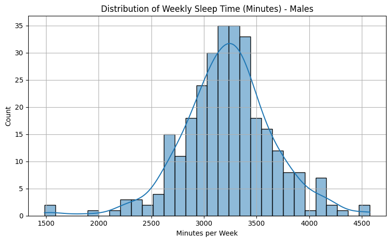

# Sleep and the Allocation of Time (Males)

This analysis examines the determinants of weekly sleep duration (in minutes) for male respondents using data from the 1975 time-use survey. A key challenge is that hourly wages are missing for non-working individuals, and wages may be endogenous—correlated with unobserved determinants of sleep.

## Data Preparation and Imputation

We filter the dataset to include only males and select relevant variables such as `sleep`, `hrwage`, `educ`, `exper`, `age`, `marr`, and `union`. To address missing `hrwage` values (~27% of cases), we train a linear regression model using `educ`, `exper`, `age`, `marr`, and `union` as predictors and use it to impute missing wages.

## Exploratory Analysis

We explore the distribution of sleep time across male respondents. The mean weekly sleep is approximately 3250 minutes (about 7.75 hours per night).

## Instrumental Variables Regression

To estimate the causal effect of wage on sleep, we use Two-Stage Least Squares (2SLS). We instrument `hrwage` with `educ` and `exper`, while controlling for `age`, `marr`, and `union`. This helps address the endogeneity of wage due to omitted variables that influence both wage and sleep (e.g., health, motivation).

## Results and Interpretation

The IV regression suggests a negative relationship between hourly wage and weekly sleep: as wages increase, individuals tend to sleep less. This aligns with economic theory—higher opportunity costs of time lead individuals to allocate less time to non-market activities like sleep.

# Sleep and the Allocation of Time - Analysis (Male Subset)


This report explores the determinants of weekly sleep time (in minutes) for males in the 1975 U.S. time-use survey, based on the dataset used by Biddle and Hamermesh.


## 1. Data Preparation

- Filtered dataset to include only male respondents (`male == 1`).
- Key variables:
  - **sleep** – weekly minutes of nighttime sleep (response variable).
  - **hrwage** – hourly wage (potentially endogenous).
  - **educ**, **exper** – instruments for wage (education and experience).
  - **age**, **marr**, **union** – exogenous controls.


```python
# IV Regression for Sleep Time (Males Only) using 2SLS with Wage Imputation

import pandas as pd
import numpy as np
import matplotlib.pyplot as plt
import seaborn as sns
from sklearn.linear_model import LinearRegression
from linearmodels.iv import IV2SLS


df = pd.read_csv("sleep75.csv")

# Assign proper column names
df.columns = [
    "age", "black", "case", "clerical", "construc", "educ", "earns74", "gdhlth",
    "inlf", "leis1", "leis2", "leis3", "smsa", "lhrwage", "lothinc", "male",
    "marr", "prot", "rlxall", "selfe", "sleep", "slpnaps", "south", "spsepay",
    "spwrk75", "totwrk", "union", "worknrm", "workscnd", "exper", "yngkid",
    "yrsmarr", "hrwage", "agesq"
]


df = df[df["male"] == 1].copy()

#IMPUTATION


wage_model_data = df[["hrwage", "educ", "exper", "age", "marr", "union"]].copy()
wage_model_data = wage_model_data.apply(pd.to_numeric, errors="coerce")
train_data = wage_model_data.dropna()

X_train = train_data[["educ", "exper", "age", "marr", "union"]]
y_train = train_data["hrwage"]

wage_model = LinearRegression()
wage_model.fit(X_train, y_train)


X_all = df[["educ", "exper", "age", "marr", "union"]].apply(pd.to_numeric, errors="coerce")
df["hrwage_predicted"] = wage_model.predict(X_all)


df["hrwage_imputed"] = df["hrwage"]
df.loc[df["hrwage_imputed"].isna(), "hrwage_imputed"] = df.loc[df["hrwage_imputed"].isna(), "hrwage_predicted"]


model_df = df[["sleep", "hrwage_imputed", "educ", "exper", "age", "marr", "union"]].copy()
model_df = model_df.rename(columns={"hrwage_imputed": "hrwage"})
model_df = model_df.apply(pd.to_numeric, errors="coerce").dropna()

# ANALYSIS STAGE

# EDA: Sleep distribution
plt.figure(figsize=(8, 5))
sns.histplot(model_df["sleep"], bins=30, kde=True)
plt.title("Distribution of Weekly Sleep Time (Minutes) - Males")
plt.xlabel("Minutes per Week")
plt.ylabel("Count")
plt.grid(True)
plt.tight_layout()
plt.show()

# IV regression: hrwage is endogenous, instrumented by educ and exper
iv_formula = "sleep ~ age + marr + union + [hrwage ~ educ + exper]"
iv_model = IV2SLS.from_formula(iv_formula, data=model_df).fit()


print(iv_model.summary)


```


    

    


                              IV-2SLS Estimation Summary                          
    ==============================================================================
    Dep. Variable:                  sleep   R-squared:                      0.8746
    Estimator:                    IV-2SLS   Adj. R-squared:                 0.8729
    No. Observations:                 292   F-statistic:                    2895.4
    Date:                Mon, Jun 02 2025   P-value (F-stat)                0.0000
    Time:                        23:11:00   Distribution:                  chi2(4)
    Cov. Estimator:                robust                                         
                                                                                  
                                 Parameter Estimates                              
    ==============================================================================
                Parameter  Std. Err.     T-stat    P-value    Lower CI    Upper CI
    ------------------------------------------------------------------------------
    age            18.762     6.5661     2.8574     0.0043      5.8929      31.631
    marr           979.73     226.34     4.3286     0.0000      536.11      1423.4
    union          355.49     125.65     2.8292     0.0047      109.22      601.77
    hrwage         232.99     51.219     4.5489     0.0000      132.60      333.38
    ==============================================================================
    
    Endogenous: hrwage
    Instruments: educ, exper
    Robust Covariance (Heteroskedastic)
    Debiased: False


## Remarks:

**Mean**: ~3,253 min/week ≈ 7.75 hours/night.

**Distribution** is approximately normal with slight left skew.

**Sleep** ranges from ~3.5 to ~10.9 hours/night.

This study, based on Biddle and Hamermesh’s “Sleep and the Allocation of Time,” investigates how individuals allocate time between market and non-market activities—specifically, how economic incentives like wage rates influence sleep. A key contribution of the original study was to model sleep not as fixed or biologically determined, but as a choice influenced by opportunity cost.

However, practical econometric issues arise:

Wage is only observed for those who work, introducing sample selection bias.
Wage may be endogenous, as both sleep and wage can be influenced by unobserved factors like health, motivation, or preferences.
This replication and extension addresses these challenges using:

Imputation for missing wage values using education and experience,
Instrumental Variables (2SLS) estimation to address endogeneity.
This approach improves the credibility of the causal interpretation: that higher wages lead to lower sleep duration, consistent with time-allocation theory.


## Conclusion

In this analysis of male respondents from a 1975 time-use survey, we find evidence that higher hourly wages are associated with lower weekly sleep time. This negative relationship remains robust when addressing potential endogeneity of wages through a Two-Stage Least Squares (2SLS) approach, using education and experience as instruments.

To overcome missing wage data for non-working individuals, we employed regression-based imputation, enabling a more complete and inclusive sample. Our findings align with the economic theory of time allocation: individuals facing higher opportunity costs for their time tend to reduce non-market activities like sleep.

Nonetheless, the study faces limitations in terms of data age, assumptions of linearity, and the potential imperfection of instruments. Future research could benefit from modern datasets with richer controls (e.g., job type, work intensity, sleep quality) and use of panel data to capture dynamic effects over time.
